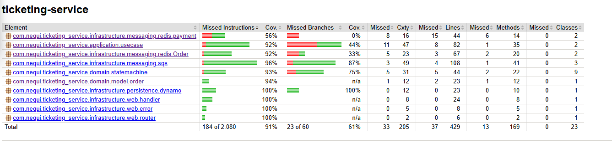
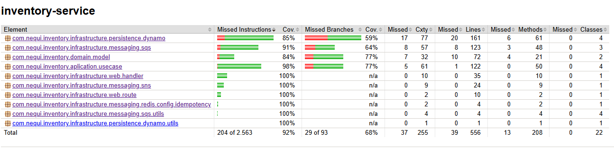
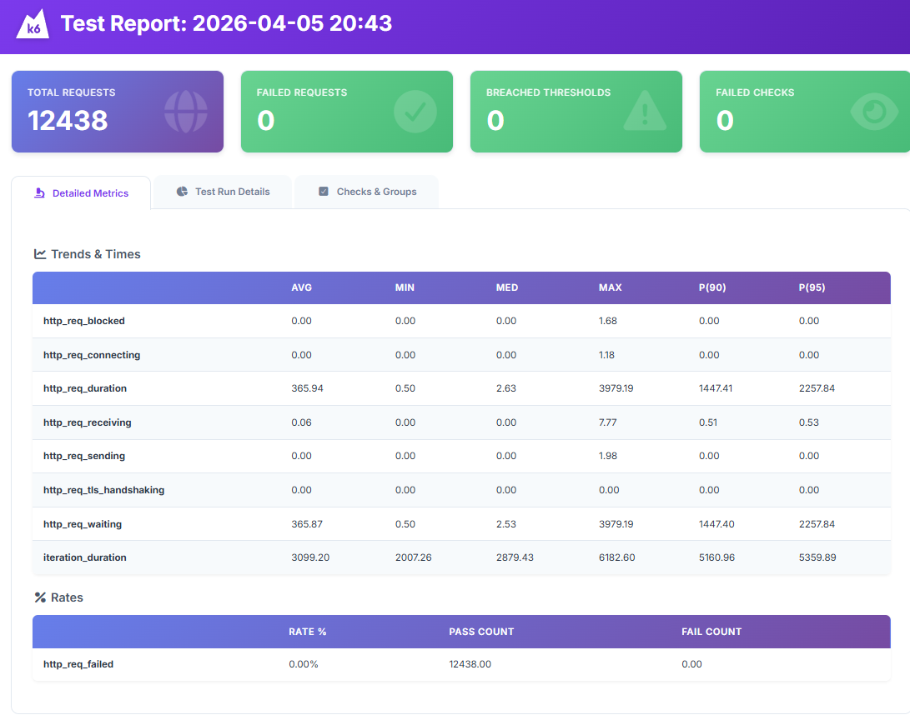
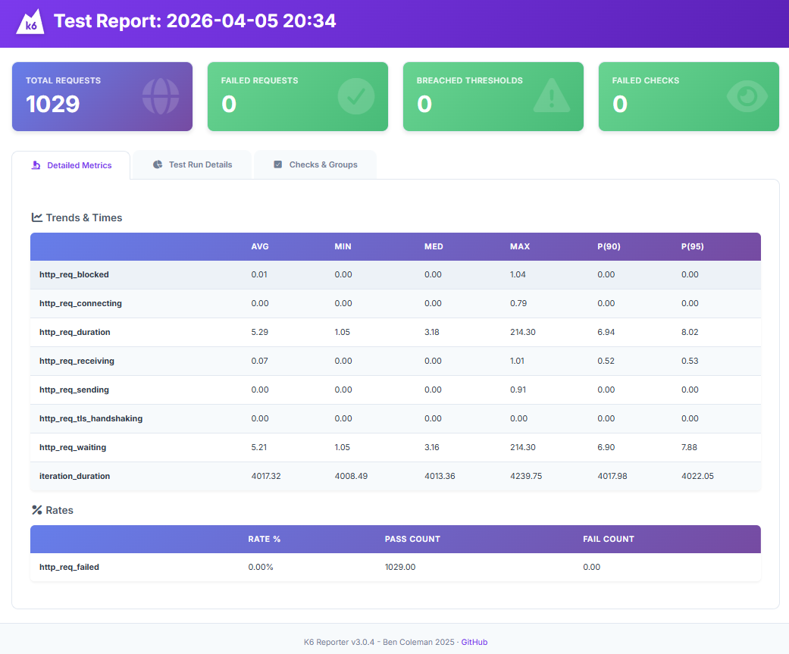
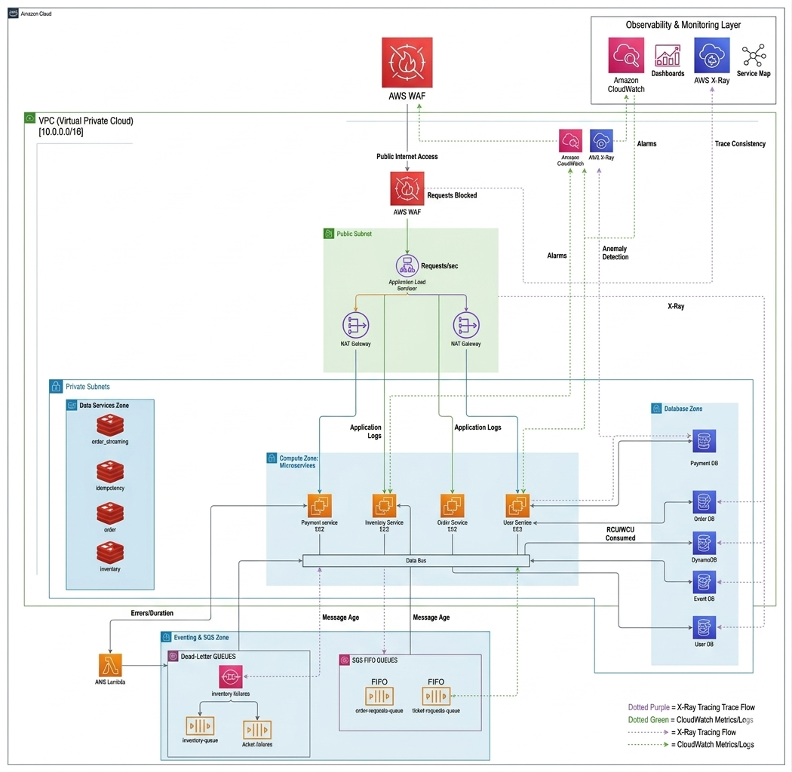

**Candidato:** Santiago Coronado  
**Rol:** Ingeniero de Software / Backend Developer  
**Proyecto:** Prueba Técnica Senior - Nequi
---

#  Reactive Ticketing Ecosystem: High-Concurrency & Event-Driven
## Visión General
Este ecosistema de microservicios es una solución de **misión crítica** diseñada para la venta masiva de entradas. La arquitectura resuelve los problemas de consistencia y latencia ante picos de demanda masivos, eliminando bloqueos de hilos y garantizando integridad transaccional mediante un modelo reactivo de punta a punta.

---

## Decisiones de Arquitectura y Patrones de Diseño

### 1. Garantía de Inventario y Control de Concurrencia
Para resolver el problema de la sobreventa de asientos en eventos de alta demanda, el sistema implementa una estrategia de **Bloqueo Optimista (Optimistic Locking)**:
* **Escrituras Condicionales:** Cada intento de reserva en la base de datos incluye una expresión de condición. El sistema solo permite el cambio a `RESERVED` si el estado actual es estrictamente `AVAILABLE`. Si dos peticiones compiten por el mismo recurso, la base de datos rechaza la segunda a nivel atómico directamente en el motor de persistencia.
* **Máquina de Estados Finita:** Los tickets y órdenes siguen un flujo de estados estricto. Un ticket en estado `SOLD` es final e inmutable, protegido por la lógica del dominio para evitar regresiones de estado o inconsistencias por procesos duplicados.

### 2. Patrón Saga y Atomicidad Distribuida
El sistema garantiza que las operaciones que involucran múltiples microservicios se comporten de manera **atómica** a nivel de negocio mediante la implementación del **Patrón Saga**:
* **Consistencia Distribuida:** En lugar de utilizar transacciones distribuidas pesadas (como 2PC), el sistema utiliza una Saga basada en eventos y coreografía. Si un paso de la transacción falla (por ejemplo, un pago rechazado por la pasarela), el sistema dispara automáticamente acciones compensatorias.
* **Acciones de Compensación (Rollback Lógico):** Estas acciones revierten los cambios realizados en pasos anteriores, como liberar automáticamente los tickets que fueron reservados, asegurando que el sistema regrese a un estado consistente y válido sin necesidad de intervención manual.

### 3. Máquinas de Estado Deterministas
Tanto el servicio de **Órdenes** como el de **Inventario** implementan internamente el patrón de **Máquina de Estados** para gestionar el ciclo de vida de sus entidades principales:
* **Transiciones Válidas:** Una entidad solo puede pasar de un estado a otro si el evento disparador es legal para el estado actual. Por ejemplo, la lógica de negocio impide cancelar una orden que ya ha sido marcada como pagada o expirar una orden que ya está en proceso de validación.
* **Estados Lógicos Únicos:** Cada entidad posee un único estado a la vez, eliminando condiciones de carrera lógicas y asegurando un comportamiento predecible ante fallos de red, reintentos de mensajes o latencia en el procesamiento.

### 4. Auditoría y Trazabilidad Total
Para garantizar la transparencia del sistema y facilitar el soporte técnico en entornos productivos, se ha implementado un esquema de auditoría robusto:
* **Tabla de Historial:** Cada cambio de estado en un ticket o en una orden se registra de forma persistente en una tabla de historial dedicada. Esto permite reconstruir la línea de tiempo completa de cualquier transacción desde su creación hasta su estado final.
* **Visibilidad de Eventos:** El historial almacena el estado anterior, el nuevo estado, el evento exacto que disparó el cambio y la marca de tiempo (timestamp). Esta trazabilidad es fundamental para verificar el cumplimiento del flujo de negocio y realizar análisis de errores en procesos críticos de compra.

### 5. Resiliencia y Manejo de Backpressure
* **Ingesta por Buffering:** El *Order Service* funciona como un amortiguador. Recibe la petición, valida el esquema y la moneda (**USD/COP**), y la envía a un stream de **Redis/SQS**. Respondemos con un `202 Accepted` de inmediato, liberando los hilos del servidor para seguir recibiendo tráfico (Backpressure control).
* **Aislamiento de Fallos:** Si el servicio de inventario se ralentiza, los mensajes se acumulan de forma segura en **SQS**, evitando que el *Order Service* sufra caídas por agotamiento de recursos.

### 6. Eficiencia con Redis y SNS Fan-out
* **Caché de Respuesta Rápida:** Implementamos **Redis** para servir la disponibilidad de eventos en milisegundos, reduciendo drásticamente la latencia y la carga en DynamoDB.
* **Patrón Fan-out para TTL:** Al expirar el tiempo de reserva (10 min), un tópico de **SNS** notifica simultáneamente a ambos microservicios. El *Order Service* marca la orden como `EXPIRED` y el *Inventory Service* libera los tickets a `AVAILABLE` de forma sincronizada.

---

###  Infraestructura Local (Docker Stack)

El ecosistema utiliza **Docker Compose** para orquestar un entorno de nube emulado. Esta configuración garantiza que los microservicios interactúen con servicios de AWS y persistencia de forma idéntica a un entorno de producción, pero con **latencia cero** y **costo cero**.

| Servicio | Imagen | Puerto | Uso en el Proyecto |
| :--- | :--- | :--- | :--- |
| **DynamoDB Local** | `amazon/dynamodb-local` | `8000` | Persistencia NoSQL para órdenes y tickets. |
| **LocalStack** | `localstack/localstack` | `4566` | Emulación de **AWS SQS** (colas) y **AWS SNS** (fan-out). |
| **Redis** | `redis:7.2` | `6379` | Caché de alta velocidad y gestión de estados de concurrencia. |
| **Init-Dynamo** | `curlimages/curl` | N/A | Contenedor efímero para la creación automática de tablas. |

---

#### Automatización y Aprovisionamiento (Init-Scripts)
Para asegurar que el entorno sea **Ready-to-Code** al instante, el stack incluye procesos de inicialización automática:

1.  **DynamoDB Initialization:** El contenedor `dynamodb-init` espera a que el motor esté listo para ejecutar scripts de creación de tablas, evitando configuraciones manuales de esquemas.
2.  **LocalStack Ready.d:** Se utiliza el punto de entrada nativo de LocalStack (`/etc/localstack/init/ready.d/`) para inyectar `aws-queues-setup.sh`. Esto crea automáticamente las colas FIFO de SQS y los tópicos de SNS necesarios para el patrón Saga.
3.  **Persistencia de Volúmenes:** Todos los datos de DynamoDB y Redis se mapean a carpetas locales (`./dynamodb-data`, `./redis-data`), permitiendo que el estado de tus pruebas persista incluso si reinicias los contenedores.

####  Comandos Rápidos
```bash
# Levantar toda la infraestructura en segundo plano
docker-compose up -d
```
```bash
# Ver el estado de los servicios y sus logs de inicio
docker-compose ps
docker-compose logs -f localstack
```
```bash
# Limpiar el entorno y borrar datos persistidos
docker-compose down -v
```
---

## Stack Tecnológico
* **Lenguaje:** Java 25 (Uso de Records, Sealed Classes y Pattern Matching).
* **Framework:** Spring Boot 4.x & WebFlux (Handlers/Routers funcionales).
* **Persistencia:** DynamoDB (NoSQL de alta escala).
* **Mensajería:** AWS SQS & SNS (vía LocalStack).
* **Cache/Streaming:** Redis 7.2.
* **IaC:** **Terraform** (Arquitectura modular con `main.tf`, `variables.tf` y `outputs.tf`).

---
##  Postman Collections

Puedes acceder a las colecciones de dos formas:

### Opción 1: Workspace en Postman
Accede directamente al workspace online:

https://www.postman.com/check-m2/workspace/nequi-ticketing-service

Desde allí puedes:
- Explorar los endpoints
- Ejecutar requests directamente
- Forkear las colecciones a tu cuenta

---

###  Opción 2: Descarga local

En la raíz del proyecto existe una carpeta llamada `postman/` que contiene todas las colecciones exportadas en formato JSON.

```bash
postman/
├── orders.postman_collection.json
├── events.postman_collection.json
├── tickets.postman_collection.json
```
---


##  Endpoints del Proyecto

El sistema cuenta con los siguientes endpoints organizados por microservicio:

---

### Order Service (Puerto 8080)

| Método | Endpoint | Descripción |
|------|--------|------------|
| POST | `/orders` | Crea una nueva orden con tickets asociados. |
| GET | `/orders/{orderId}` | Obtiene la información de una orden específica. |
| POST | `/orders/confirm` | Confirma y procesa el pago de una orden. |
| GET | `/orders/{orderId}/history` | Obtiene el historial de estados de una orden. |

#### Ejemplo Request - Crear Orden

```json
{
  "userId": "123e4567-e89b-12d3-a456-426614174000",
  "eventId": "7c9e6679-7425-40de-944b-e07fc1f90ae7",
  "totalPrice": 150.0,
  "currency": "USD",
  "seatIds": ["ac5a8cb0-a853-444f-a594-94c387a3f357"]
}
```
---
###  Event Service (Puerto 8081)

| Método | Endpoint | Descripción |
|--------|----------|-------------|
| POST | `/events` | Crea un nuevo evento. |
| GET | `/events` | Obtiene la lista de eventos (streaming). |

####  Ejemplo Request - Crear Evento

```json
{
  "eventId": "7c9e6679-7425-40e-944b-e07fc1f90ae7",
  "name": "Nequi Music Experience 2026",
  "location": "Estadio Atanasio Girardot, Medellín",
  "totalCapacity": 50
}
```

---

### 🎟️ Ticket Service (Puerto 8081)

| Método | Endpoint | Descripción |
|--------|----------|-------------|
| GET | `/tickets/stream/available/{eventId}` | Obtiene tickets disponibles en tiempo real para un evento. |
| GET | `/events/{eventId}/tickets/{ticketId}/status` | Consulta el estado de un ticket específico. |

---

## Estrategia de Testing (Pirámide de Calidad)
Hemos aplicado una metodología **AAA (Arrange-Act-Assert)** con los siguientes niveles de cobertura:

* **60% Unit Testing (JUnit 5 & Mockito):** Pruebas exhaustivas de la lógica de dominio, validaciones de moneda y transiciones de la Máquina de Estados.
* **25% Integration Testing (StepVerifier):** Pruebas de flujo reactivo sin bloqueo, verificando la integración con DynamoDB Local y LocalStack.
* **15% E2E & Smoke Tests:** Validación del flujo completo desde el `RouterFunction/Handler` hasta la persistencia final.
* **Gestión Global de Errores:** Un `GlobalExceptionHandler` captura excepciones reactivas y las transforma en respuestas estandarizadas con códigos de negocio (ej. `EVT-004` para conflictos de concurrencia), cumpliendo con el estándar de Webflux.
---

## pruebas de cobertura Order service


## pruebas de cobertura Inventory service

##  Benchmarking & Performance Analysis (k6)

Para validar la resiliencia y el comportamiento reactivo del ecosistema, sometimos la **arquitectura** a pruebas de carga bajo un escenario de recursos limitados (emulando un entorno de servidor modesto). Se evaluó el flujo transaccional completo: 
`Crear Orden` → `Consultar Estado` → `Confirmar Pago`.


###  Resultados de las Pruebas

| Métrica | Escenario 1: Carga Nominal | Escenario 2: Stress Test |
| :--- | :--- | :--- |
| **Usuarios Concurrentes (VUs)** | 20 usuarios | 100 usuarios |
| **Latencia P95** | **8.02 ms** | **2,257 ms (2.2s)** |
| **Peticiones Totales** | ~1,000 solicitudes | ~12,400 solicitudes |
| **Tasa de Éxito (Success)** | **100%** | **100%** |
| **Errores de Red/HTTP** | 0 | 0 |

---
### Resultados
- sobre 100 useuarios con 12,400 solicitudes



- sobre 20 useuarios con 1000 solicitudes


---

###  Análisis de Resultados

#### **Escenario 1: Eficiencia Reactiva**
* **Insight:** En condiciones normales, el uso de **Spring WebFlux + Netty** permite una respuesta casi instantánea.
* **Comportamiento:** El *Event Loop* procesa las peticiones sin bloqueos de hilos, manteniendo tiempos de respuesta de un solo dígito (8ms), lo cual es ideal para aplicaciones de misión crítica con alta experiencia de usuario.

#### **Escenario 2: Punto de Inflexión y Saturación**
* **Degradación Controlada:** Bajo un estrés masivo (100 VUs), el sistema experimenta un aumento en la latencia debido al encolamiento (*queuing*) de peticiones en los buffers de entrada. Sin embargo, la latencia se estabiliza sin disparar errores de *Timeout*.
* **Resiliencia Probada:** A pesar de la saturación de recursos, el microservicio mantuvo una **disponibilidad del 100%**. No se presentaron caídas de conexión ni corrupción de datos, demostrando que la arquitectura es capaz de absorber picos de tráfico extremo sin colapsar, priorizando la integridad transaccional.

---

###  Notas de Optimización Post-Stress
Basado en los hallazgos de **k6**, se identifican las siguientes rutas de escalabilidad para entornos de producción:
1.  **Horizontal Scaling:** Implementar auto-escalado en **AWS ECS Fargate** basado en la métrica de latencia P95 cuando esta supere los 500ms.
2.  **R2DBC Connection Pooling:** Optimizar el pool de conexiones reactivas para reducir la contención de I/O en la persistencia durante ráfagas de tráfico.

---

##  Roadmap y Escalabilidad Cloud

Aunque el ambiente de desarrollo es local, la arquitectura ha sido diseñada bajo principios **Cloud-Ready**, asegurando una transición fluida hacia un entorno de producción real en AWS:

###  Infraestructura como Código (IaC)
Se incluyen módulos de **Terraform** listos para producción que permiten desplegar la infraestructura completa de forma automatizada:
* **Computo:** Configuración para **AWS ECS Fargate**, permitiendo un escalado elástico de los microservicios sin gestionar servidores.
* **Mensajería:** Transición transparente de LocalStack a **Amazon SQS** (colas estándar y FIFO) y **Amazon SNS** para el abanico de eventos (*Fan-out*).
* **Persistencia:** Configuración de **DynamoDB con Global Tables**, garantizando alta disponibilidad y replicación multi-región.

###  Observabilidad y Trazabilidad Distribuida
El sistema está preparado para una operación transparente en la nube:
* **Tracing:** Implementación lista para inyectar `traceId` en los headers de cada petición, facilitando la trazabilidad de punta a punta en **AWS X-Ray** o **CloudWatch ServiceLens**.
* **Logs Estructurados:** Formateo de logs compatible con **CloudWatch Logs Insights** para realizar consultas complejas sobre el comportamiento del sistema en tiempo real.

### Resiliencia Inteligente y Análisis de Errores
* **DLQ** Los mensajes que terminan en la **Dead Letter Queue (DLQ)** mantienen su contexto original.
* **Estrategia de Retries:** Implementación de *Exponential Backoff* y *Jitter* para evitar tormentas de reintentos sobre servicios críticos de la nube.

---

### diagrama de arquitectura aws



## Despliegue

## CI/CD Pipeline de Despliegue a Producción

Este proyecto cuenta con un pipeline de CI/CD orientado a despliegue en producción, diseñado bajo prácticas de **DevSecOps**, garantizando calidad, seguridad y confiabilidad antes de liberar cualquier cambio.

El flujo de despliegue se compone de las siguientes fases:

### 1. Validación de Infraestructura (Infrastructure as Code)
Se ejecutan procesos de validación sobre la infraestructura definida en Terraform (`init`, `validate`, `plan`), asegurando que los recursos en la nube sean consistentes y estén correctamente configurados antes de cualquier despliegue.

### 2. Análisis de Seguridad de Dependencias (SCA)
Se realiza un escaneo de dependencias para identificar vulnerabilidades conocidas (CVE), reduciendo riesgos asociados a librerías de terceros.

### 3. Construcción, Pruebas y Control de Calidad
Se compilan los microservicios y se ejecutan pruebas automatizadas. Como criterio obligatorio, se valida que la cobertura de código mediante JaCoCo sea superior al **90%**, garantizando un alto nivel de calidad y testeo.

### 4. Seguridad en Ejecución y Preparación de Despliegue
Se ejecutan pruebas de seguridad dinámicas (DAST), simulando ataques sobre la aplicación en ejecución para detectar vulnerabilidades en tiempo real. Adicionalmente, se valida el flujo de despliegue hacia AWS (ECR y ECS).

---

## Flujo del Pipeline

```text
Commit / Pull Request
        ↓
Validación de Infraestructura (Terraform)
        ↓
Análisis de Seguridad (SCA)
        ↓
Build + Tests + Cobertura (JaCoCo > 90%)
        ↓
Pruebas de Seguridad Dinámicas (DAST)
        ↓
Despliegue a Producción (AWS)
```

